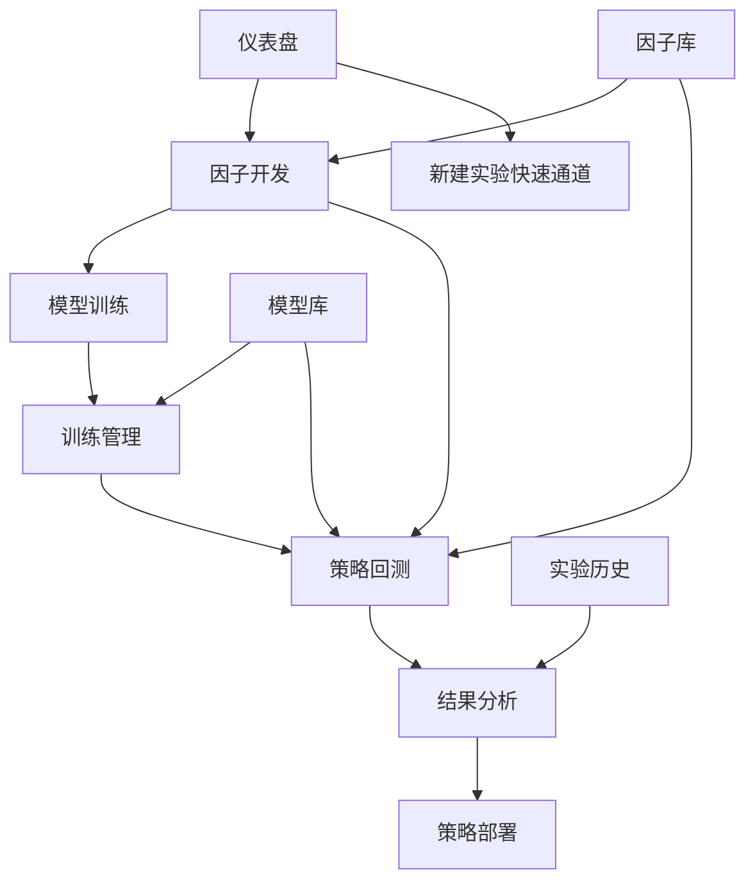

# Qlib-Web 页面交互设计优化方案

## 一、现状分析

### 当前项目架构
基于现有代码分析，qlib-web目前包含以下核心页面：
- **Dashboard (仪表盘)**: 展示实验概览和快速操作入口
- **CreateExperiment (新建实验)**: 单一的实验创建表单，包含模型、策略、回测配置
- **ExperimentHistory (历史记录)**: 实验列表管理
- **ExperimentDetail (实验详情)**: 单个实验的详细分析结果
- **Login/Register (认证页面)**: 用户认证
- **TeamManagement (团队管理)**: 多用户协作

### 设计文档目标
根据 `qlib-web项目设计.md`，系统应该支持完整的量化投资工作流程：
1. **AI因子助手** - 因子开发工具
2. **模型训练** - 独立的模型训练模块  
3. **策略回测** - 依赖因子和模型的回测执行
4. **训练列表** - 模型管理和评估
5. **结果管理** - 回测结果统一管理
6. **策略部署** - 实盘交易部署

## 二、页面交互流程设计

### 1. 主导航设计

```
┌─ Qlib Web Console ──────────────────────────────────────────┐
│ 🏠 [仪表盘] │ 🧮 [因子开发] │ 🤖 [模型训练] │ 📊 [策略回测] │
│ 📋 [训练管理] │ 📈 [结果分析] │ 🚀 [策略部署] │          │
└───────────────────────────────────────────────────────────┘
```

### 2. 核心工作流程交互设计

#### 流程A: 完整的策略研发路径
```
因子开发 → 模型训练 → 训练管理 → 策略回测 → 结果分析 → 策略部署
   ↓          ↓          ↓          ↓          ↓          ↓
 因子表达式  训练任务   模型文件   回测配置   性能报告   实盘部署
```

#### 流程B: 快速验证路径
```
仪表盘 → 新建实验 (整合版) → 结果查看
   ↓         ↓                  ↓
 概览     一键式配置         快速结果
```

### 3. 页面状态管理和数据依赖



## 三、具体页面交互优化方案

### 3.1 仪表盘 (Dashboard) - 工作流程入口

#### 优化重点
- **状态概览**: 显示各模块的任务状态和依赖关系
- **快速访问**: 提供多种工作流程的快速入口

#### 界面布局优化
```
┌─ 仪表盘 ──────────────────────────────────────────────────┐
│ 📊 系统状态                                              │
│ ┌─────────────────────────────────────────────────────┐ │
│ │ 📈 活跃任务: 3个训练中 | 2个回测中 | 1个部署运行     │ │
│ │ 🎯 建议操作: 查看LightGBM_v3训练结果 → 启动回测      │ │
│ └─────────────────────────────────────────────────────┘ │
│                                                         │
│ 🚀 工作流程快速启动                                     │
│ ┌─────────────┐ ┌─────────────┐ ┌─────────────┐       │
│ │ 🧮 完整研发   │ │ ⚡ 快速回测  │ │ 📋 管理任务  │       │
│ │ 从因子开发    │ │ 使用现有模型 │ │ 查看所有进度 │       │ 
│ │ 到策略部署    │ │ 快速验证策略 │ │ 管理资源     │       │
│ └─────────────┘ └─────────────┘ └─────────────┘       │
│                                                         │
│ 📈 最近活动与结果                                       │
│ [显示最近的因子、训练、回测活动，支持一键跳转]           │
└─────────────────────────────────────────────────────────┘
```

### 3.2 因子开发页面 (Factor Development)

#### 新增页面设计
```
┌─ AI因子助手 ──────────────────────────────────────────────┐
│ [💬 AI对话] [⌨️ 手动编辑] [📚 因子库] [🔍 因子测试]        │
│                                                         │
│ 💬 与AI对话生成因子                                     │
│ ┌─────────────────────────────────────────────────────┐ │
│ │ 用户: 我想要一个动量因子，关注最近20天的价格趋势      │ │
│ │ 🤖 AI: 为您生成20日动量因子...                        │ │
│ │ 表达式: ($close / Ref($close, 20)) - 1               │ │
│ │ [📊 预览效果] [💾 保存到因子库] [➡️ 直接用于训练]       │ │
│ └─────────────────────────────────────────────────────┘ │
│                                                         │
│ 📚 因子库管理                                           │
│ ┌─────────────────────────────────────────────────────┐ │
│ │ • 20日动量因子 ✅ 已验证 [编辑] [应用] [删除]         │ │
│ │ • 市盈率倒数因子 ✅ 已验证 [编辑] [应用] [删除]       │ │
│ │ • RSI技术指标 ⚠️ 待测试 [编辑] [测试] [删除]          │ │
│ └─────────────────────────────────────────────────────┘ │
│                                                         │
│ [🔄 批量测试] [📤 导出因子库] [➡️ 开始模型训练]           │
└─────────────────────────────────────────────────────────┘
```

#### 交互流程
1. **AI对话模式**: 自然语言描述投资逻辑，AI生成因子表达式
2. **因子验证**: 实时预览因子效果，支持历史数据回测验证
3. **因子库管理**: 统一管理所有因子，支持版本控制和分类
4. **无缝流转**: 完成因子开发后，一键跳转到模型训练页面

### 3.3 模型训练页面 (Model Training)

#### 优化现有CreateExperiment页面
```
┌─ 模型训练配置 ────────────────────────────────────────────┐
│ 📋 数据来源确认                                         │
│ ┌─────────────────────────────────────────────────────┐ │
│ │ 📊 数据集: 沪深300 | 时间: 2020-2023 ✅ 数据就绪     │ │
│ │ 🧮 因子: 来自因子库 [选择3个因子 ▼] ✅ 因子可用       │ │
│ └─────────────────────────────────────────────────────┘ │
│                                                         │
│ 🤖 智能模型推荐                                         │
│ ┌─────────────────────────────────────────────────────┐ │
│ │ 推荐: LightGBM (适合您的因子类型)                    │ │
│ │ 替代: XGBoost | LSTM | Linear                        │ │
│ │ [⚙️ 快速配置] [🔧 高级参数] [📋 导入模板]             │ │
│ └─────────────────────────────────────────────────────┘ │
│                                                         │
│ 🎯 训练目标与设置                                       │
│ [标准回归预测 ▼] [未来5日收益率] [滚动训练模式]          │
│                                                         │
│ [🚀 开始训练] [💾 保存配置模板] [📊 查看历史训练]        │
└─────────────────────────────────────────────────────────┘
```

#### 实时训练监控
```
┌─ 训练进度实时监控 ────────────────────────────────────────┐
│ 🏃‍♂️ LightGBM_动量策略_v1 训练中...                        │
│ ████████████████████████████████████████████░░░ 85%     │
│                                                         │
│ 📊 实时指标                                             │
│ 训练误差: 0.0245 ↓ | 验证误差: 0.0267 ↓ | ETA: 3分钟    │
│                                                         │
│ 📋 操作选项                                             │
│ [⏸️ 暂停] [⏹️ 停止] [📈 查看图表] [📋 查看日志]          │
│                                                         │
│ 🔔 完成后操作                                           │
│ ☑️ 自动保存到模型库                                     │
│ ☑️ 发送完成通知                                         │
│ ☐ 立即开始回测 [➡️ 跳转到回测配置]                      │
└─────────────────────────────────────────────────────────┘
```

### 3.4 训练管理页面 (Training Management)

#### 替换现有ExperimentHistory为更专业的训练管理
```
┌─ 模型训练管理中心 ────────────────────────────────────────┐
│ [📊 概览] [🤖 模型库] [📈 性能对比] [🔄 批量操作]          │
│                                                         │
│ 🏆 模型性能排行榜                                       │
│ ┌─────────────────────────────────────────────────────┐ │
│ │ 模型名称         准确率  训练时间  状态    操作        │ │
│ │ LightGBM_v3     94.2%   45分钟   ✅完成  [回测][下载] │ │
│ │ XGBoost_test    91.8%   38分钟   ✅完成  [回测][下载] │ │
│ │ LSTM_momentum   89.5%   120分钟  🔄训练  [查看][停止] │ │
│ └─────────────────────────────────────────────────────┘ │
│                                                         │
│ 🔄 批量操作与自动化                                     │
│ [📋 选择模型] → [🚀 批量回测] [📤 批量导出] [🗑️ 批量删除] │
│                                                         │
│ 💡 智能建议                                             │
│ • LightGBM_v3 性能优秀，建议进行策略回测                │
│ • LSTM模型训练时间过长，考虑调整参数                     │
│ • 发现3个过拟合模型，建议重新训练                       │
└─────────────────────────────────────────────────────────┘
```

### 3.5 策略回测页面 (Strategy Backtesting)

#### 依赖管理和配置向导
```
┌─ 策略回测配置向导 ────────────────────────────────────────┐
│ 步骤 1/4: 依赖检查 ✅                                    │
│ ┌─────────────────────────────────────────────────────┐ │
│ │ 🧮 因子依赖: 20日动量, 市盈率倒数, RSI ✅ 全部可用    │ │
│ │ 🤖 模型选择: LightGBM_v3 (94.2%准确率) ✅ 已加载      │ │
│ └─────────────────────────────────────────────────────┘ │
│                                                         │
│ 步骤 2/4: 策略配置                                      │
│ ┌─────────────────────────────────────────────────────┐ │
│ │ 策略类型: [TopK策略 ▼]                               │ │
│ │ 选股数量: [20] 股 | 调仓频率: [日频 ▼]               │ │
│ │ 风险控制: ☑️ 止损(-10%) ☑️ 止盈(+30%) ☐ 行业限制     │ │
│ └─────────────────────────────────────────────────────┘ │
│                                                         │
│ 步骤 3/4: 回测设置                                      │
│ [时间范围] [交易成本] [基准对比] [资金规模]              │
│                                                         │
│ 步骤 4/4: 确认启动                                      │
│ [📋 配置预览] [🚀 开始回测] [💾 保存为模板]              │
└─────────────────────────────────────────────────────────┘
```

#### 实时回测监控
```
┌─ 策略回测实时监控 ────────────────────────────────────────┐
│ 📈 TopK_LightGBM_v3_回测 进行中... (第847/1000天)       │
│ ████████████████████████████████████████░░░░ 84.7%      │
│                                                         │
│ 📊 实时性能指标                                         │
│ 当前净值: 1.245 | 累计收益: +24.5% | 最大回撤: -8.2%    │
│ 夏普比率: 1.35 | 胜率: 58.3% | 基准超额: +16.2%         │
│                                                         │
│ 📈 实时图表                                             │
│ [净值曲线] [回撤分析] [持仓分布] [交易记录]              │
│                                                         │
│ 🎯 完成后操作                                           │
│ ☑️ 自动生成分析报告                                     │
│ ☑️ 保存到结果库                                         │
│ ☐ 自动开始优化建议分析                                   │
│ ☐ 推送到策略部署候选                                     │
└─────────────────────────────────────────────────────────┘
```

### 3.6 结果分析页面 (Results Analysis)

#### 升级现有ExperimentDetail为综合分析中心
```
┌─ 策略结果综合分析 ────────────────────────────────────────┐
│ [📊 概览] [📈 性能分析] [🔍 归因分析] [💡 优化建议] [🏆 排名]│
│                                                         │
│ 🏆 策略表现排行与对比                                   │
│ ┌─────────────────────────────────────────────────────┐ │
│ │ 策略名称    年化收益 夏普比率 最大回撤 状态 操作      │ │
│ │ 🥇TopK_v3    +28.5%   1.45   -8.2%   ⭐优秀 [部署]  │ │
│ │ 🥈LSTM_v2    +25.1%   1.38   -12.1%  ⭐良好 [部署]  │ │
│ │ 🥉动量策略   +22.3%   1.22   -15.6%  ✅可用 [优化]  │ │
│ └─────────────────────────────────────────────────────┘ │
│                                                         │
│ 📊 多维度对比分析                                       │
│ [收益风险散点图] [月度收益热力图] [行业归因分析]         │
│                                                         │
│ 💡 AI智能建议                                           │
│ • TopK_v3策略表现优秀，建议部署到模拟交易环境            │
│ • 策略在熊市表现较差，建议增加防御性因子                 │
│ • 发现换手率偏高，建议调整调仓频率降低交易成本           │
│                                                         │
│ 🚀 一键操作                                             │
│ [📤 导出报告] [🔄 重新回测] [🚀 部署策略] [📋 创建模板]  │
└─────────────────────────────────────────────────────────┘
```

### 3.7 策略部署页面 (Strategy Deployment)

#### 新增专业的部署管理页面
```
┌─ 策略部署管理中心 ────────────────────────────────────────┐
│ [📊 概览] [🎯 部署配置] [📱 实盘监控] [⚠️ 风险管理]       │
│                                                         │
│ 🎯 部署配置向导                                         │
│ ┌─────────────────────────────────────────────────────┐ │
│ │ 选择策略: TopK_LightGBM_v3 (年化28.5%, 夏普1.45)     │ │
│ │ 部署模式: ○模拟交易 ●实盘交易                        │ │
│ │ 资金规模: 100万 | 风险限额: 单日-3% 总回撤-10%       │ │
│ │ 交易接口: [华泰证券API ▼] 状态: ✅已连接              │ │
│ └─────────────────────────────────────────────────────┘ │
│                                                         │
│ 📱 实盘监控仪表盘                                       │
│ ┌─────────────────────────────────────────────────────┐ │
│ │ 🟢 策略运行状态: 正常                                │ │
│ │ 当前净值: 1.0356 | 今日收益: +0.25% | 持仓: 20股     │ │
│ │ 最近操作: [14:30] 买入贵州茅台 100股                 │ │
│ └─────────────────────────────────────────────────────┘ │
│                                                         │
│ ⚠️ 智能风险监控                                         │
│ [📈 仓位监控] [📊 风险指标] [🚨 异常告警] [🛡️ 风控规则]  │
│                                                         │
│ 📲 告警与通知                                           │
│ ☑️ 微信推送 ☑️ 邮件通知 ☑️ 短信告警                     │
└─────────────────────────────────────────────────────────┘
```

## 四、交互流程优化建议

### 4.1 工作流状态管理

#### 全局状态跟踪
```typescript
interface WorkflowState {
  factors: {
    available: FactorDefinition[]
    selected: string[]
    status: 'ready' | 'editing' | 'testing'
  }
  models: {
    trained: ModelInfo[]
    training: TrainingTask[]
    selected?: string
  }
  strategies: {
    configured: StrategyConfig[]
    running: BacktestTask[]
    completed: BacktestResult[]
  }
  deployment: {
    active: DeployedStrategy[]
    monitoring: MonitoringData[]
  }
}
```


### 4.2 页面间数据流优化

#### 无缝数据传递
```typescript
// 从因子开发直接跳转到模型训练，并自动填充因子选择
const navigateToTraining = (selectedFactors: string[]) => {
  router.push({
    name: 'ModelTraining',
    query: { factors: selectedFactors.join(',') }
  })
}

// 从训练完成直接跳转到回测，并自动填充模型选择
const navigateToBacktest = (modelId: string) => {
  router.push({
    name: 'StrategyBacktest',
    query: { model: modelId, autoConfig: 'true' }
  })
}
```

#### 智能预填充配置
```typescript
// 基于用户历史行为和当前状态智能预填充表单
const getSmartDefaults = (context: UserContext) => {
  return {
    dataConfig: {
      stockPool: context.mostUsedStockPool || 'CSI300',
      timeRange: context.preferredTimeRange || '3years'
    },
    modelConfig: {
      type: context.bestPerformingModel || 'LightGBM'
    },
    strategyConfig: {
      type: context.preferredStrategy || 'TopK'
    }
  }
}
```

### 4.3 用户体验优化

#### 进度保存与恢复
```typescript
// 自动保存用户配置进度
const autoSaveProgress = () => {
  const formData = getCurrentFormData()
  localStorage.setItem('workflow_progress', JSON.stringify({
    page: currentPage,
    data: formData,
    timestamp: Date.now()
  }))
}

// 页面加载时恢复进度
const restoreProgress = () => {
  const saved = localStorage.getItem('workflow_progress')
  if (saved) {
    const progress = JSON.parse(saved)
    showProgressRestoreDialog(progress)
  }
}
```

#### 多设备同步
```typescript
// 通过后端API同步用户配置和进度
const syncUserProgress = async () => {
  await api.saveUserProgress({
    currentWorkflow: getCurrentWorkflowState(),
    preferences: getUserPreferences(),
    templates: getUserTemplates()
  })
}
```

## 五、技术实现要点

### 5.1 前端架构调整

#### 路由结构重组
```typescript
const routes = [
  {
    path: '/',
    component: Layout,
    children: [
      { path: 'dashboard', component: Dashboard },
      { path: 'factors', component: FactorDevelopment },      // 新增
      { path: 'training', component: ModelTraining },         // 重构
      { path: 'training-management', component: TrainingMgmt }, // 新增
      { path: 'backtest', component: StrategyBacktest },      // 重构
      { path: 'results', component: ResultsAnalysis },        // 重构
      { path: 'deployment', component: StrategyDeployment },   // 新增
      { path: 'teams', component: TeamManagement }
    ]
  }
]
```

#### 状态管理增强
```typescript
// 新增专门的工作流状态管理
export const useWorkflowStore = defineStore('workflow', {
  state: (): WorkflowState => ({
    factors: { available: [], selected: [], status: 'ready' },
    models: { trained: [], training: [], selected: undefined },
    strategies: { configured: [], running: [], completed: [] },
    deployment: { active: [], monitoring: [] }
  }),
  
  actions: {
    async loadFactorLibrary() { /* ... */ },
    async startModelTraining(config: TrainingConfig) { /* ... */ },
    async executeBacktest(config: BacktestConfig) { /* ... */ },
    async deployStrategy(config: DeploymentConfig) { /* ... */ }
  }
})
```

### 5.2 后端API扩展

#### 新增API端点
```python
# 因子管理相关
@router.post("/api/v1/factors/generate")
async def ai_generate_factor(prompt: str)

@router.get("/api/v1/factors/library")
async def get_factor_library()

@router.post("/api/v1/factors/validate")
async def validate_factor_expression(expression: str)

# 工作流管理相关
@router.get("/api/v1/workflow/state")
async def get_workflow_state(user_id: str)

@router.post("/api/v1/workflow/sync")
async def sync_workflow_progress(state: WorkflowState)

```

## 六、实施建议

### 第一阶段：核心功能重构 (2-3周)
1. **因子开发页面**: 新增AI对话功能和因子库管理
2. **训练管理页面**: 升级现有历史记录页面为专业训练管理
3. **工作流状态管理**: 实现全局状态跟踪

### 第二阶段：用户体验优化 (2周)
1. **页面间数据流**: 实现无缝跳转和智能预填充
2. **进度保存**: 实现自动保存和多设备同步
3. **智能提示**: 基于用户行为的智能操作建议

### 第三阶段：高级功能 (3-4周)
1. **策略部署页面**: 实现模拟交易和实盘接口
2. **结果分析升级**: 多维度对比和AI优化建议
3. **移动端适配**: 响应式设计和移动端专用功能

这个设计方案充分考虑了现有代码基础，在保持系统稳定性的同时，大幅提升了用户体验和工作效率。通过智能化的流程引导和无缝的数据流转，用户可以更高效地完成从因子开发到策略部署的完整量化投资工作流程。