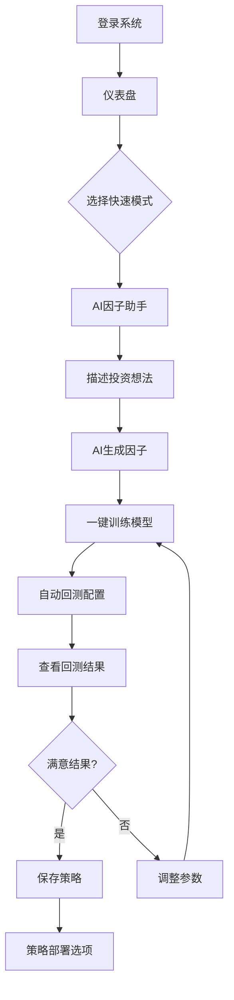
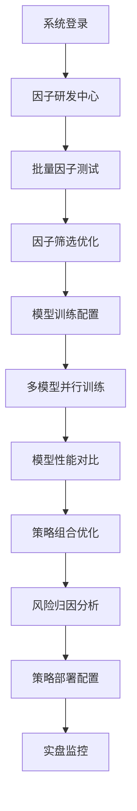
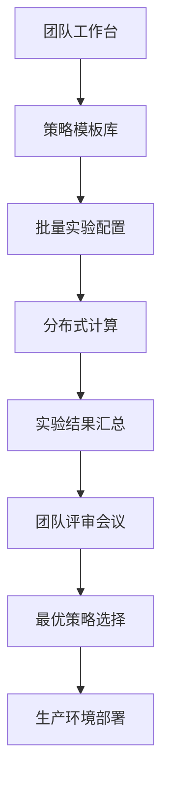
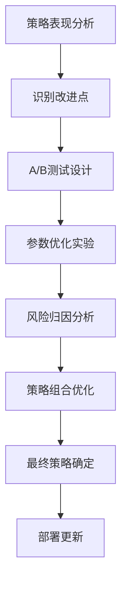

# 用户操作路径设计

## 一、用户角色与使用场景

### 1.1 用户角色分析

#### 初级用户（量化新手）
- **特征**: 对量化投资有兴趣但缺乏实践经验
- **需求**: 简单易用的界面、详细的指导、模板化的操作
- **痛点**: 不知道从哪里开始、参数设置困难、结果解读困难

#### 中级用户（有一定经验）
- **特征**: 有基础的量化知识，能独立完成简单策略开发
- **需求**: 高效的工作流程、丰富的工具、灵活的配置
- **痛点**: 重复性操作多、缺乏高级功能、协作困难

#### 专家用户（量化专家）
- **特征**: 资深量化研究员或基金经理
- **需求**: 高度自定义、批量操作、深度分析、团队协作
- **痛点**: 工具限制多、无法满足复杂需求、效率不够高

### 1.2 核心使用场景

1. **快速验证投资想法**: 从想法到回测结果的最短路径
2. **系统性策略研发**: 完整的因子开发到模型训练流程
3. **模型性能对比**: 多个模型和策略的批量测试对比
4. **策略优化迭代**: 基于回测结果的策略参数调优
5. **实盘策略部署**: 从回测到实盘的完整部署流程

## 二、核心操作路径设计

### 2.1 路径A: 快速验证路径（新手友好）



#### 详细操作步骤

**步骤1: 快速入门引导**
```
仪表盘 - 新手引导卡片
┌─────────────────────────────────────────────────────────┐
│ 🎯 快速开始您的第一个量化策略                            │
│                                                         │
│ 💡 告诉我们您的投资想法，我们帮您快速验证                │
│                                                         │
│ 示例想法：                                              │
│ • "最近涨得快的股票可能继续上涨"                         │
│ • "低市盈率的股票有投资价值"                            │
│ • "成交量异常放大的股票值得关注"                        │
│                                                         │
│ [🚀 开始创建策略] [📚 查看教程] [🎲 随机生成示例]        │
└─────────────────────────────────────────────────────────┘
```

**步骤2: AI交互式因子生成**
```
AI因子助手 - 对话模式
┌─────────────────────────────────────────────────────────┐
│ 💬 与AI助手对话                                         │
│ ┌─────────────────────────────────────────────────────┐ │
│ │ 👤 用户: 我觉得最近20天涨幅大的股票还会继续涨        │ │
│ │                                                     │ │
│ │ 🤖 AI: 这是一个经典的动量策略思路！我为您生成了     │ │
│ │    20日价格动量因子。                              │ │
│ │                                                     │ │
│ │    📊 因子表达式: ($close / Ref($close, 20)) - 1   │ │
│ │                                                     │ │
│ │    📈 历史表现预览: [显示因子在过去1年的表现图表]    │ │
│ │    • 年化超额收益: +12.3%                          │ │
│ │    • 信息比率: 1.25                                │ │
│ │    • 胜率: 58.7%                                   │ │
│ │                                                     │ │
│ │    [✅ 满意，继续] [🔄 调整参数] [💬 继续优化]       │ │
│ └─────────────────────────────────────────────────────┘ │
│                                                         │
│ 💡 优化建议:                                            │
│ • 可以结合其他因子，如市值、估值等                       │
│ • 建议设置止损条件降低风险                               │
│ • 可以考虑行业中性化处理                                │
│                                                         │
│ [➡️ 立即训练模型] [📚 保存到因子库] [🔧 手动调整]        │
└─────────────────────────────────────────────────────────┘
```

**步骤3: 一键式模型训练**
```
智能模型训练 - 简化配置
┌─────────────────────────────────────────────────────────┐
│ 🤖 智能模型配置                                         │
│                                                         │
│ 📊 数据配置 (已智能推荐)                                │
│ • 股票池: 沪深300 ✅                                    │
│ • 时间范围: 2020-2024 (4年数据) ✅                       │
│ • 训练方式: 滚动训练 ✅                                  │
│                                                         │
│ 🧮 因子配置                                             │
│ • 主因子: 20日价格动量 ✅                               │
│ • 辅助因子: 自动添加市值、PE等基础因子 ✅                │
│                                                         │
│ 🎯 模型推荐: LightGBM (最适合您的因子类型)               │
│ • 预计训练时间: 15-25分钟                               │
│ • 预期准确率: 85-90%                                    │
│                                                         │
│ [🚀 开始训练] [⚙️ 高级设置] [📋 使用模板]                │
└─────────────────────────────────────────────────────────┘
```

**步骤4: 训练监控与自动回测**
```
训练进度与自动化
┌─────────────────────────────────────────────────────────┐
│ 🏃‍♂️ 模型训练中... 进度: 73%                             │
│ ████████████████████████████████████████████░░░░░░      │
│                                                         │
│ ⏱️ 预计剩余时间: 6分钟                                  │
│ 📊 当前准确率: 87.3% (超出预期 ✨)                       │
│                                                         │
│ 🔄 训练完成后自动执行:                                  │
│ ☑️ 保存模型到模型库                                     │
│ ☑️ 生成模型性能报告                                     │
│ ☑️ 启动策略回测 (使用推荐配置)                           │
│ ☑️ 发送完成通知                                         │
│                                                         │
│ [⏸️ 暂停] [📋 查看详细日志] [📱 离开页面也会继续]        │
│                                                         │
│ 💡 趁训练期间，您可以:                                  │
│ • 📚 查看量化投资教程                                   │
│ • 🎯 设计更多投资策略                                   │
│ • 👥 邀请团队成员协作                                   │
└─────────────────────────────────────────────────────────┘
```

**步骤5: 回测结果展示与决策**
```
回测结果仪表盘
┌─────────────────────────────────────────────────────────┐
│ 🎉 恭喜！您的策略表现优秀                                │
│                                                         │
│ 📈 核心指标                                             │
│ ┌─────────────────────────────────────────────────────┐ │
│ │         您的策略    沪深300基准    超额表现           │ │
│ │ 年化收益   +18.5%      +8.2%       +10.3% ✨        │ │
│ │ 夏普比率    1.42       0.65        --               │ │
│ │ 最大回撤   -12.8%     -28.5%       风险更低 ✨       │ │
│ │ 胜率       61.3%       --          表现稳定 ✨       │ │
│ └─────────────────────────────────────────────────────┘ │
│                                                         │
│ 📊 收益曲线 [显示与基准对比的净值曲线图]                 │
│                                                         │
│ 💡 AI评价: 这是一个表现优秀的动量策略，建议部署！        │
│                                                         │
│ 🎯 下一步操作:                                          │
│ [🚀 部署到模拟交易] [📤 分享给朋友] [🔄 优化参数]       │
│ [📊 查看详细分析] [💾 保存为模板] [📱 设置监控]         │
└─────────────────────────────────────────────────────────┘
```

### 2.2 路径B: 专业研发路径（进阶用户）



#### 详细操作流程

**步骤1: 因子研发工作台**
```
因子研发中心 - 专业模式
┌─────────────────────────────────────────────────────────┐
│ 🧮 量化因子研发工作台                                   │
│                                                         │
│ [📊 因子库] [🔬 因子实验室] [📈 因子回测] [🤖 AI助手]    │
│                                                         │
│ 📚 我的因子库 (23个因子)                                │
│ ┌─────────────────────────────────────────────────────┐ │
│ │ 因子名称        类型    IC值   排名IC  状态   操作    │ │
│ │ 20日动量因子    技术    0.045   0.038   ✅    [编辑] │ │
│ │ 营收增长因子    基本面  0.062   0.051   ✅    [编辑] │ │
│ │ 成交量异动      技术    0.028   0.023   ⚠️    [优化] │ │
│ │ 分析师预期差    情绪    0.039   0.035   ✅    [编辑] │ │
│ └─────────────────────────────────────────────────────┘ │
│                                                         │
│ 🔬 批量操作:                                            │
│ [✅ 全选] [📊 批量回测] [🔄 批量优化] [📤 导出报告]      │
│                                                         │
│ 💡 AI建议: 发现3个高相关性因子，建议进行正交化处理       │
│ [🔧 自动优化] [📋 查看详情]                             │
└─────────────────────────────────────────────────────────┘
```

**步骤2: 多因子组合优化**
```
因子组合实验室
┌─────────────────────────────────────────────────────────┐
│ 🔬 多因子组合优化实验                                   │
│                                                         │
│ 📊 候选因子池 (已选择8个因子)                           │
│ ┌─────────────────────────────────────────────────────┐ │
│ │ [✅] 20日动量 (权重: 25%) | IC: 0.045 | 相关性: 低   │ │
│ │ [✅] 营收增长 (权重: 30%) | IC: 0.062 | 相关性: 低   │ │
│ │ [✅] ROE因子  (权重: 20%) | IC: 0.051 | 相关性: 中   │ │
│ │ [⬜] 流动性因子 (建议权重: 15%) | 与营收增长高度相关  │ │
│ └─────────────────────────────────────────────────────┘ │
│                                                         │
│ ⚙️ 优化配置:                                            │
│ • 优化目标: [最大化IC_IR ▼]                             │
│ • 约束条件: [行业中性 ✅] [市值中性 ✅] [风格中性 ⬜]    │
│ • 滚动窗口: [252天 ▼] 更新频率: [月度 ▼]                │
│                                                         │
│ 📈 预期效果预览:                                        │
│ • 预期年化IC: 0.058 → 0.071 (+22.4% 提升)              │
│ • 预期IC_IR: 1.23 → 1.45 (+17.9% 提升)                 │
│ • 因子覆盖度: 87.3% (优秀)                              │
│                                                         │
│ [🚀 开始优化] [💾 保存配置] [📊 历史回测]                │
└─────────────────────────────────────────────────────────┘
```

**步骤3: 高级模型训练配置**
```
专业模型训练配置
┌─────────────────────────────────────────────────────────┐
│ 🤖 高级机器学习模型配置                                 │
│                                                         │
│ 📊 数据配置                                             │
│ • 全市场股票池: 4,200只股票 ✅                          │
│ • 时间范围: 2018-2024 (6年) ✅                          │
│ • 前瞻期: 20个交易日收益率 ✅                           │
│ • 数据清洗: 剔除ST、停牌、新股等 ✅                      │
│                                                         │
│ 🧠 模型配置 (多模型并行训练)                            │
│ ┌─────────────────────────────────────────────────────┐ │
│ │ [✅] LightGBM    预计时间: 45分钟   期望准确率: 88%   │ │
│ │ [✅] XGBoost     预计时间: 65分钟   期望准确率: 87%   │ │
│ │ [✅] CatBoost    预计时间: 55分钟   期望准确率: 89%   │ │
│ │ [✅] LSTM        预计时间: 120分钟  期望准确率: 85%   │ │
│ │ [⬜] Transformer 预计时间: 180分钟  期望准确率: 90%   │ │
│ └─────────────────────────────────────────────────────┘ │
│                                                         │
│ ⚙️ 高级设置:                                            │
│ • 交叉验证: 时间序列5折验证 ✅                           │
│ • 早停机制: 验证集无改善20轮停止 ✅                       │
│ • 超参优化: Optuna自动调参 ✅                           │
│ • 特征工程: 自动特征选择+PCA降维 ✅                      │
│                                                         │
│ 💻 资源配置:                                            │
│ • GPU加速: Tesla V100 x2 ✅                             │
│ • 并行训练: 4个模型同时训练 ✅                           │
│ • 总预计时间: 120分钟 (并行执行)                        │
│                                                         │
│ [🚀 启动训练集群] [📊 监控面板] [⏰ 定时启动]            │
└─────────────────────────────────────────────────────────┘
```

### 2.3 路径C: 批量测试路径（团队协作）



#### 团队协作操作流程

**步骤1: 团队实验管理**
```
团队策略研发中心
┌─────────────────────────────────────────────────────────┐
│ 👥 量化团队协作平台                                     │
│                                                         │
│ 📊 团队概览                                             │
│ • 活跃成员: 8人 | 进行中实验: 15个 | 本月新策略: 23个    │
│                                                         │
│ 🏆 本周排行榜                                           │
│ ┌─────────────────────────────────────────────────────┐ │
│ │ 成员      贡献因子  训练模型  策略表现  团队积分      │ │
│ │ 张研究员    12个      8个     🥇+28.5%    2,340分   │ │
│ │ 李分析师     8个      5个     🥈+25.1%    1,890分   │ │
│ │ 王工程师     6个      10个    🥉+22.8%    1,650分   │ │
│ └─────────────────────────────────────────────────────┘ │
│                                                         │
│ 🎯 本周团队目标                                         │
│ • 完成100个因子的大规模回测 (进度: 73/100) ✅           │
│ • 优化现有策略夏普比率到1.5以上 (当前最高: 1.42) ⚠️    │
│ • 部署3个策略到模拟交易环境 (已完成: 1个) ⏳             │
│                                                         │
│ [📊 团队看板] [🎯 分配任务] [💬 讨论区] [📈 绩效报告]    │
└─────────────────────────────────────────────────────────┘
```

**步骤2: 批量实验配置**
```
批量实验配置中心
┌─────────────────────────────────────────────────────────┐
│ 🔬 大规模策略实验配置                                   │
│                                                         │
│ 📋 实验设计                                             │
│ • 实验名称: Q4季度策略筛选实验                           │
│ • 实验目标: 从100个候选策略中筛选出10个优秀策略           │
│ • 负责人: 张研究员 | 参与者: 李分析师, 王工程师          │
│                                                         │
│ 🧮 因子组合矩阵 (3x3x2 = 18种组合)                      │
│ ┌─────────────────────────────────────────────────────┐ │
│ │ 技术因子: [动量] [反转] [成交量]                     │ │
│ │ 基本面因子: [估值] [盈利] [成长]                     │ │
│ │ 风险控制: [无风控] [20%止损]                        │ │
│ └─────────────────────────────────────────────────────┘ │
│                                                         │
│ 🤖 模型配置矩阵 (18x5 = 90个模型)                       │
│ • LightGBM | XGBoost | CatBoost | LSTM | Linear         │
│                                                         │
│ 📊 回测配置                                             │
│ • 股票池: 沪深300, 中证500, 中证1000                    │
│ • 时间段: 2020-2024 (滚动回测)                          │
│ • 调仓频率: 日频, 周频, 月频                            │
│                                                         │
│ 💻 计算资源                                             │
│ • 预计总实验数: 18×5×3×3 = 810个实验                    │
│ • 预计总时间: 72小时 (分布式执行)                       │
│ • 所需GPU: 8卡并行                                      │
│                                                         │
│ [🚀 启动实验] [⏰ 定时执行] [📊 实时监控]                │
└─────────────────────────────────────────────────────────┘
```

### 2.4 路径D: 策略优化路径（迭代改进）



## 三、智能引导系统设计

### 3.1 新手引导流程

```typescript
// 新手引导配置
const newUserGuidance = {
  steps: [
    {
      target: '.dashboard-quick-start',
      title: '欢迎来到Qlib量化平台！',
      content: '让我们从一个简单的投资想法开始，创建您的第一个量化策略',
      position: 'bottom',
      nextAction: 'highlight_ai_assistant'
    },
    {
      target: '.ai-factor-assistant',
      title: 'AI因子助手',
      content: '只需用自然语言描述您的投资想法，AI会帮您转换为专业的量化因子',
      position: 'right',
      example: '"我觉得最近涨得快的股票还会继续涨"',
      nextAction: 'open_ai_dialog'
    },
    {
      target: '.factor-preview',
      title: '因子效果预览',
      content: '您可以实时看到因子在历史数据上的表现，帮助您判断因子的有效性',
      position: 'left',
      metrics: ['年化收益', '信息比率', '胜率'],
      nextAction: 'proceed_to_training'
    }
    // ... 更多步骤
  ],
  
  checkpoints: [
    'first_factor_created',
    'first_model_trained',
    'first_backtest_completed',
    'first_strategy_deployed'
  ]
}
```

### 3.2 上下文感知帮助系统

```vue
<!-- components/help/ContextualHelp.vue -->
<template>
  <div class="contextual-help">
    <!-- 右侧浮动帮助面板 -->
    <el-drawer
      v-model="showHelp"
      title="智能助手"
      direction="rtl"
      size="400px"
    >
      <div class="help-content">
        <!-- 当前页面指导 -->
        <div class="current-guidance">
          <h3>{{ currentPageGuide.title }}</h3>
          <p>{{ currentPageGuide.description }}</p>
          
          <div class="quick-tips">
            <h4>快速提示:</h4>
            <ul>
              <li v-for="tip in currentPageGuide.tips" :key="tip">
                {{ tip }}
              </li>
            </ul>
          </div>
        </div>

        <!-- 相关教程 -->
        <div class="related-tutorials">
          <h4>相关教程:</h4>
          <div 
            v-for="tutorial in relatedTutorials" 
            :key="tutorial.id"
            class="tutorial-card"
            @click="openTutorial(tutorial)"
          >
            <h5>{{ tutorial.title }}</h5>
            <p>{{ tutorial.description }}</p>
            <el-tag size="small">{{ tutorial.duration }}</el-tag>
          </div>
        </div>

        <!-- 常见问题 -->
        <div class="faq-section">
          <h4>常见问题:</h4>
          <el-collapse v-model="activeFaq">
            <el-collapse-item
              v-for="faq in contextualFaq"
              :key="faq.id"
              :title="faq.question"
              :name="faq.id"
            >
              <div v-html="faq.answer"></div>
            </el-collapse-item>
          </el-collapse>
        </div>

        <!-- 联系支持 -->
        <div class="support-section">
          <el-button type="primary" @click="contactSupport">
            <el-icon><Message /></el-icon>
            联系技术支持
          </el-button>
        </div>
      </div>
    </el-drawer>

    <!-- 浮动帮助按钮 -->
    <el-button
      class="help-trigger"
      type="primary"
      circle
      @click="showHelp = true"
    >
      <el-icon><QuestionFilled /></el-icon>
    </el-button>

    <!-- 智能提示气泡 -->
    <div
      v-if="smartTip && showSmartTip"
      class="smart-tip-bubble"
      :style="smartTipPosition"
    >
      <div class="tip-content">
        <h5>💡 {{ smartTip.title }}</h5>
        <p>{{ smartTip.content }}</p>
        <div class="tip-actions">
          <el-button size="small" type="text" @click="dismissTip">
            知道了
          </el-button>
          <el-button size="small" type="primary" @click="followTip">
            {{ smartTip.actionText }}
          </el-button>
        </div>
      </div>
      <div class="tip-arrow"></div>
    </div>
  </div>
</template>

<script setup lang="ts">
import { computed, ref, watch } from 'vue'
import { useRoute } from 'vue-router'
import { useWorkflowStore } from '@/stores/workflow'

const route = useRoute()
const workflowStore = useWorkflowStore()

const showHelp = ref(false)
const showSmartTip = ref(false)
const activeFaq = ref('')

// 根据当前页面提供上下文帮助
const currentPageGuide = computed(() => {
  const guides = {
    '/factors': {
      title: '因子开发指南',
      description: '在这里您可以创建和管理量化因子，这是量化投资的基础',
      tips: [
        '使用AI助手快速生成因子表达式',
        '测试因子的历史表现以验证有效性',
        '保存有效因子到因子库以便重复使用'
      ]
    },
    '/training': {
      title: '模型训练指南',
      description: '使用机器学习算法训练预测模型',
      tips: [
        '选择合适的因子组合提高模型性能',
        '调整模型参数以获得最佳效果',
        '使用交叉验证避免过拟合'
      ]
    },
    // ... 更多页面指南
  }
  
  return guides[route.path] || {
    title: '使用指南',
    description: '欢迎使用Qlib量化投资平台',
    tips: []
  }
})


### 3.3 个性化推荐系统

```typescript
// composables/usePersonalization.ts
export function usePersonalization() {
  const userStore = useUserStore()
  const workflowStore = useWorkflowStore()
  
  // 分析用户行为模式
  const analyzeUserBehavior = () => {
    const behavior = userStore.getBehaviorData()
    
    return {
      preferredWorkflow: detectPreferredWorkflow(behavior),
      skillLevel: assessSkillLevel(behavior),
      interests: extractInterests(behavior),
      strugglingAreas: identifyStrugglingAreas(behavior)
    }
  }
  
  // 生成个性化推荐
  const getPersonalizedRecommendations = () => {
    const profile = analyzeUserBehavior()
    const recommendations = []
    
    if (profile.skillLevel === 'beginner') {
      recommendations.push({
        type: 'tutorial',
        title: '量化投资基础教程',
        description: '从零开始学习量化投资',
        priority: 'high'
      })
    }
    
    if (profile.strugglingAreas.includes('factor_creation')) {
      recommendations.push({
        type: 'tip',
        title: '因子创建技巧',
        description: '了解如何创建有效的量化因子',
        priority: 'medium'
      })
    }
    
    if (profile.interests.includes('risk_management')) {
      recommendations.push({
        type: 'feature',
        title: '风险管理工具',
        description: '使用高级风险管理功能',
        priority: 'low'
      })
    }
    
    return recommendations
  }
  
  return {
    analyzeUserBehavior,
    getPersonalizedRecommendations
  }
}
```

## 四、移动端适配设计

### 4.1 移动端操作流程简化

```vue
<!-- 移动端简化界面 -->
<template>
  <div class="mobile-interface">
    <!-- 底部标签栏导航 -->
    <el-tabbar v-model="activeTab" @change="handleTabChange">
      <el-tabbar-item name="dashboard">
        <el-icon><DataLine /></el-icon>
        <span>首页</span>
      </el-tabbar-item>
      
      <el-tabbar-item name="factors">
        <el-icon><Calculator /></el-icon>
        <span>因子</span>
      </el-tabbar-item>
      
      <el-tabbar-item name="training">
        <el-icon><Cpu /></el-icon>
        <span>训练</span>
      </el-tabbar-item>
      
      <el-tabbar-item name="results">
        <el-icon><TrendCharts /></el-icon>
        <span>结果</span>
      </el-tabbar-item>
    </el-tabbar>

    <!-- 快速操作浮动按钮 -->
    <el-affix position="bottom" :offset="80">
      <el-button
        type="primary"
        circle
        size="large"
        class="quick-action-fab"
        @click="showQuickActions = true"
      >
        <el-icon><Plus /></el-icon>
      </el-button>
    </el-affix>

    <!-- 快速操作面板 -->
    <el-drawer
      v-model="showQuickActions"
      direction="btt"
      size="300px"
      title="快速操作"
    >
      <div class="mobile-quick-actions">
        <div class="action-grid">
          <div
            v-for="action in mobileQuickActions"
            :key="action.id"
            class="action-item"
            @click="executeAction(action)"
          >
            <el-icon class="action-icon">
              <component :is="action.icon" />
            </el-icon>
            <span class="action-label">{{ action.label }}</span>
          </div>
        </div>
      </div>
    </el-drawer>
  </div>
</template>
```

### 4.2 语音交互功能

```typescript
// composables/useVoiceInteraction.ts
export function useVoiceInteraction() {
  const isListening = ref(false)
  const transcript = ref('')
  
  // 语音识别
  const startListening = () => {
    if (!('webkitSpeechRecognition' in window)) {
      ElMessage.error('您的浏览器不支持语音识别')
      return
    }
    
    const recognition = new webkitSpeechRecognition()
    recognition.lang = 'zh-CN'
    recognition.continuous = true
    recognition.interimResults = true
    
    recognition.onstart = () => {
      isListening.value = true
    }
    
    recognition.onresult = (event) => {
      let finalTranscript = ''
      for (let i = event.resultIndex; i < event.results.length; i++) {
        if (event.results[i].isFinal) {
          finalTranscript += event.results[i][0].transcript
        }
      }
      
      if (finalTranscript) {
        transcript.value = finalTranscript
        processVoiceCommand(finalTranscript)
      }
    }
    
    recognition.onerror = () => {
      isListening.value = false
      ElMessage.error('语音识别出错，请重试')
    }
    
    recognition.onend = () => {
      isListening.value = false
    }
    
    recognition.start()
  }
  
  // 处理语音命令
  const processVoiceCommand = (command: string) => {
    const commands = {
      '创建因子': () => router.push('/factors'),
      '开始训练': () => router.push('/training'),
      '查看结果': () => router.push('/results'),
      '显示帮助': () => showHelp.value = true
    }
    
    for (const [key, action] of Object.entries(commands)) {
      if (command.includes(key)) {
        action()
        break
      }
    }
  }
  
  return {
    isListening,
    transcript,
    startListening
  }
}
```

## 五、实施优先级建议

### 第一阶段 (4-6周): 核心路径实现
1. **快速验证路径**: 专注新手用户的端到端体验
2. **基础引导系统**: 实现页面内指导和操作提示
3. **移动端适配**: 核心功能的移动端支持

### 第二阶段 (6-8周): 专业功能增强
1. **专业研发路径**: 支持高级用户的复杂工作流
2. **团队协作功能**: 多人协作和批量实验

### 第三阶段 (4-6周): 体验优化
1. **语音交互**: 移动端语音操作支持
2. **AI助手增强**: 更智能的对话和建议
3. **性能优化**: 大规模实验的性能提升

<function_calls>
<invoke name="TodoWrite">
<parameter name="todos">[{"id": "1", "content": "\u5206\u6790\u73b0\u6709\u9879\u76ee\u67b6\u6784\u548c\u9875\u9762\u7ed3\u6784", "status": "completed"}, {"id": "2", "content": "\u8bbe\u8ba1\u9875\u9762\u95f4\u4ea4\u4e92\u6d41\u7a0b\u548c\u7528\u6237\u4f53\u9a8c\u4f18\u5316\u65b9\u6848", "status": "completed"}, {"id": "3", "content": "\u8bbe\u8ba1\u7edf\u4e00\u7684\u5bfc\u822a\u548c\u72b6\u6001\u7ba1\u7406\u65b9\u6848", "status": "completed"}, {"id": "4", "content": "\u63d0\u51fa\u6570\u636e\u6d41\u548c\u9875\u9762\u8df3\u8f6c\u7684\u4f18\u5316\u5efa\u8bae", "status": "completed"}, {"id": "5", "content": "\u521b\u5efa\u5177\u4f53\u7684\u7528\u6237\u64cd\u4f5c\u8def\u5f84\u8bbe\u8ba1", "status": "completed"}]